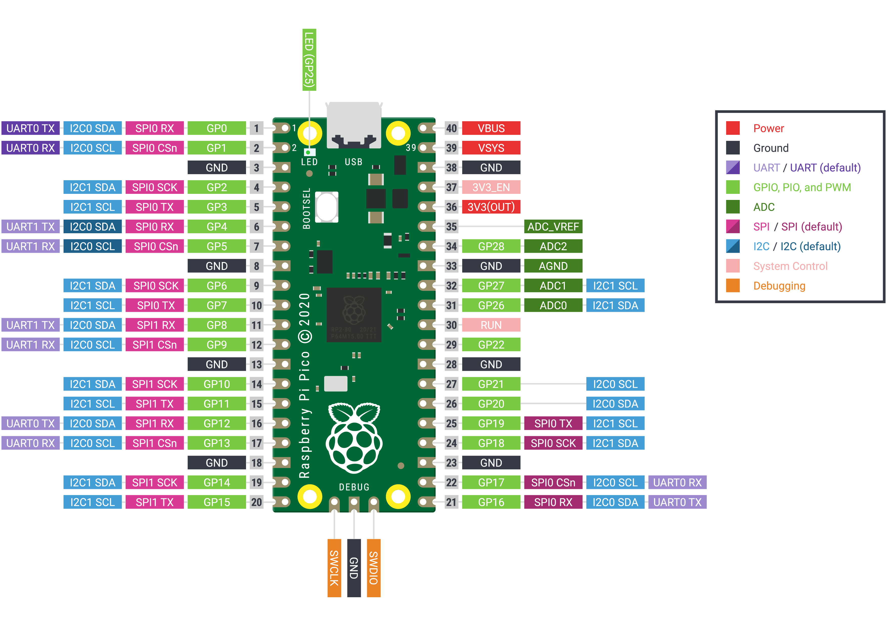
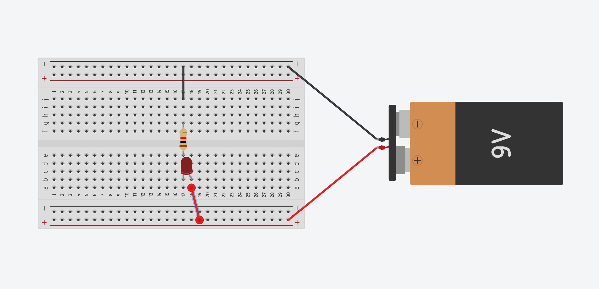
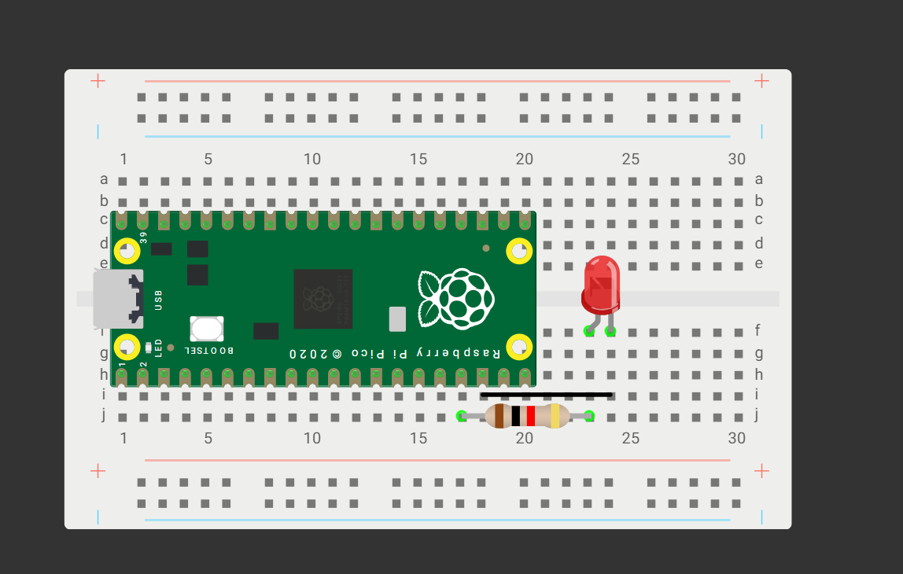

# Pico-Basics

Today we will review what we learn last time and practice blinking the onboard led. Click the following link for the website.

# **[CLICK HERE FOR PICO SIMULATOR](https://wokwi.com/projects/new/micropython-pi-pico)**

# **https://wokwi.com/projects/new/micropython-pi-pico**

# **[CLICK HERE FOR PICO/Python IDE](https://thonny.org/)**

# **https://thonny.org/**

# **[CLICK HERE FOR Youtube Tutorials for everything PICO and MicroController related by Paul McWhorter](https://youtu.be/SL4_oU9t8Ss?si=PL5aMmQ7UfyJJpZM)**

# **https://youtu.be/SL4_oU9t8Ss?si=PL5aMmQ7UfyJJpZM**

## Example Code

### Hello World

Try typing the following example.

```python
print("Hello, World!")
```
### Basic Math with Variables

```python
# Define variables
a = 10
b = 5

# Perform arithmetic operations
sum_result = a + b
difference = a - b
product = a * b
quotient = a / b

# Output the results
print("Sum:", sum_result)
print("Difference:", difference)
print("Product:", product)
print("Quotient:", quotient)

```

## What are the pins on a Pico



### Blinking the Onboard LED

```python
import machine
import time

# Initialize the onboard LED (GPIO 25)
led = machine.Pin(25, machine.Pin.OUT)

while True:
    led.value(1)      # Turn LED on
    time.sleep(0.5)   # Wait for 0.5 seconds
    led.value(0)      # Turn LED off
    time.sleep(0.5)   # Wait for 0.5 seconds

```

### Simply Circuit Review



### What is Thonny?

1. Open Thonny on your laptop.
2. Plug in your Raspberry Pi Pico
3. Select the COM port for the Pico
4. (If needed) ask for help downloading the correct library

### Combining Simple Circuits and Pico



### Code for Blinking an External LED

```python
import machine
import time

led = machine.Pin(13, machine.Pin.OUT)

while True:
    led.value(1)      # Turn LED on
    time.sleep(0.5)   # Wait for 0.5 seconds
    led.value(0)      # Turn LED off
    time.sleep(0.5)   # Wait for 0.5 seconds

```

